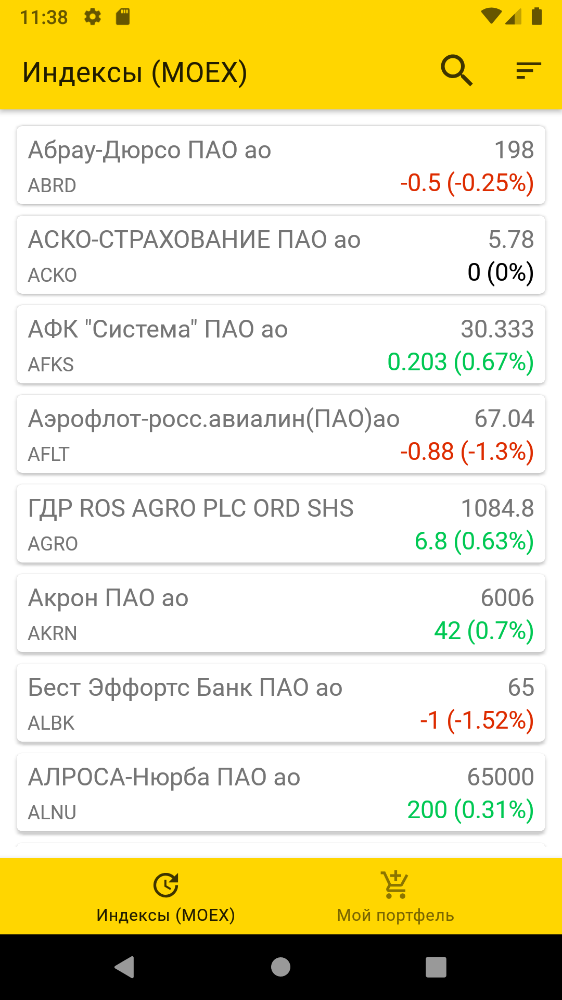
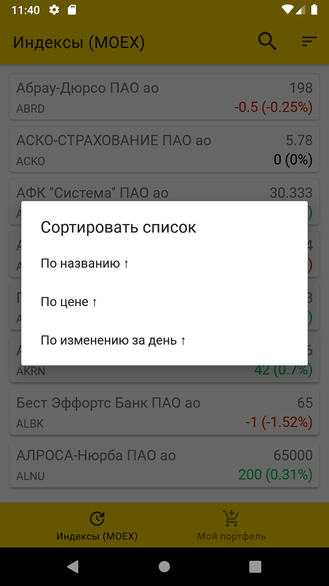
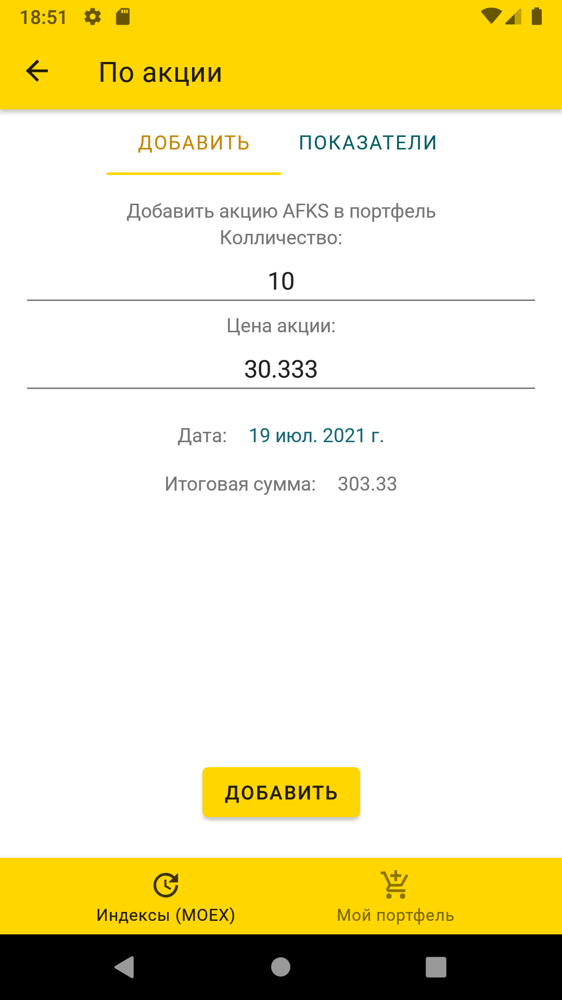
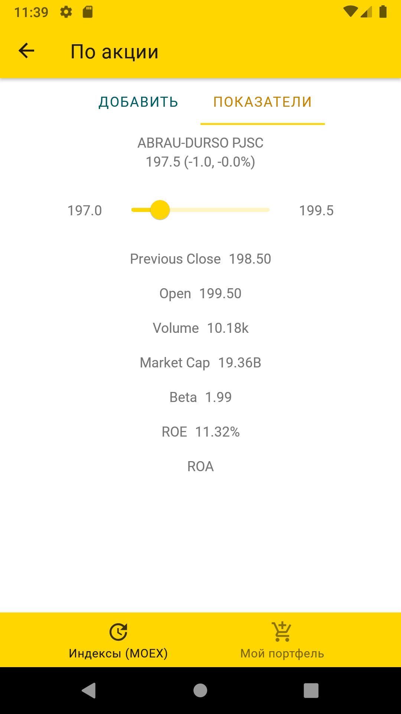
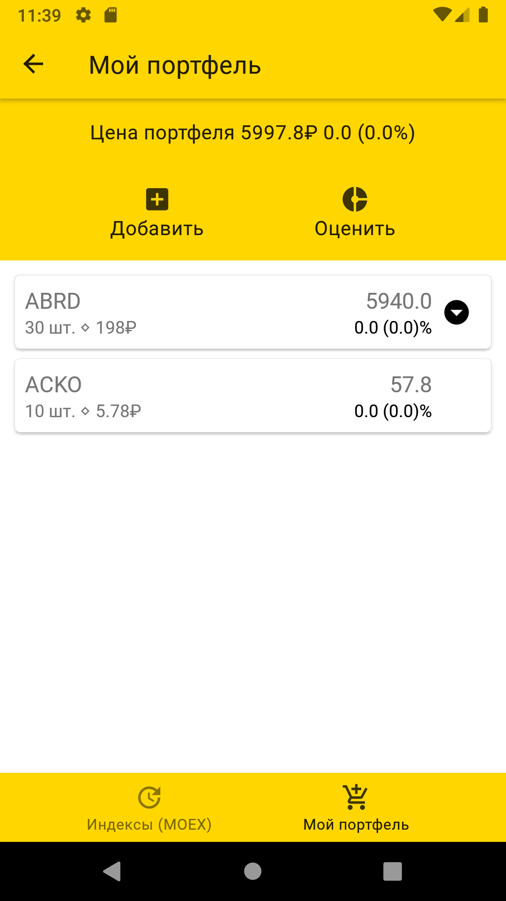
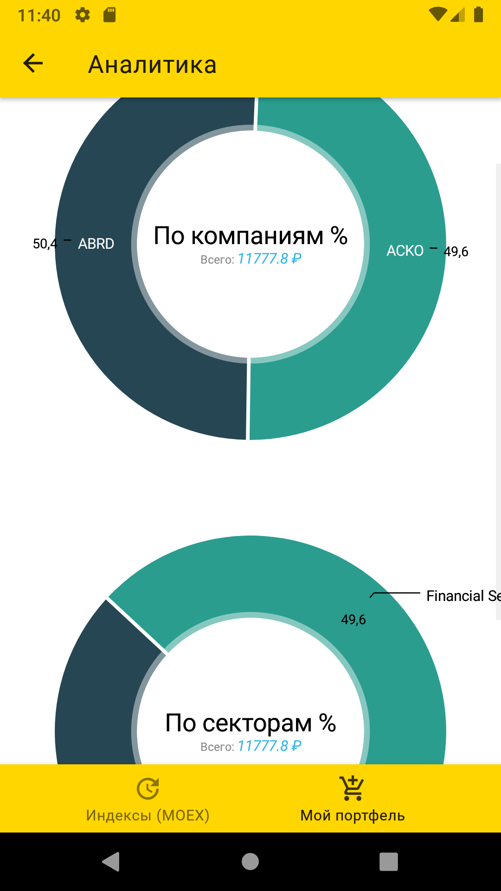

InvestAdviser
=============

InvestAdviser is a simple app written on Kotlin that demonstrates how to obtain stock base data from
https://www.moex.com/ and stock's additinal information from https://www.yahoo.com/.

Introduction
------------

InvestAdviser's GooglePlay page: https://play.google.com/store/apps/details?id=com.goranatos.investadviser

App's features
------------
You can:
* See current MOEX securies list with such data as Name, SecurityId, Current Price, Day value/percent price change
* Using search to find stock you need
* Organaze securitiy list by name, price, day price change
* Add security to your Portfolio and set share's quantity, price, date
* See additional share info like day range price, open price, volume, market cap, Beta, ROE, ROA
* See your portfolio purchase history and price change
* See simple analitics of your portfolio 

Screenshots
-----------

<table style="padding:20px">
  <tr>
    <td>
      
      &nbsp;&nbsp;&nbsp;&nbsp;
      
    </td>
    <td width="30%">
      MoexSecuritiesListFragment where you can:  
      - see necessary information and sort Moex securities list 
      - add selected stock in portfolio</td>
  </tr>
  
   <tr>
    <td>
      
      &nbsp;&nbsp;&nbsp;&nbsp;
      
    </td>
    <td width="30%">
      DetailedMoexSecurityItemFragment where you can:   
      - add selected MOEX security to your portfolio with setting price, quantity and date  
      - see additional stock info</td>
  </tr>
  
  <tr>
    <td>
      
      &nbsp;&nbsp;&nbsp;&nbsp;
      
    </td>
    <td width="30%">
      PortfolioFragment where you can:   
      - see your portfolio purchase history and price change 
      - see portfolio brief analitics 
    </td>
  </tr>
  
</table>
  
Libraries Used
--------------
* ViewBinding
* ViewModel
* LiveData
* Room
* Navigation
* MaterialDesign
* Kotlin Android Coroutines
* Lifecycles
* Animations and Transitions
* [Firebase: Performance, Crashlitics, Analitics][0] for analize users app's performance, crashes and getting statistics
* [Kodein][1] for dependency injection
* [Glide][2] for image loading
* [MPAndroidChart][3] A powerful & easy to use chart library for Android 
* [groupie][7] for recycle view easy usage
* [retrofit][8] A type-safe HTTP client for Android and Java.
* [Gson][9] Gson is a Java library that can be used to convert Java Objects into their JSON representation.
* [ThreeTenABP][10] An adaptation of the JSR-310 backport for Android.

[0]: https://firebase.google.com/
[1]: https://github.com/Kodein-Framework/Kodein-DI
[2]: https://bumptech.github.io/glide/
[3]: https://github.com/PhilJay/MPAndroidChart
[7]: https://github.com/lisawray/groupie
[8]: https://github.com/square/retrofit
[9]: https://github.com/google/gson
[10]: https://github.com/JakeWharton/ThreeTenABP

License
-------

  https://www.apache.org/licenses/LICENSE-2.0

Unless required by applicable law or agreed to in writing, software
distributed under the License is distributed on an "AS IS" BASIS, WITHOUT
WARRANTIES OR CONDITIONS OF ANY KIND, either express or implied.  See the
License for the specific language governing permissions and limitations under
the License.
